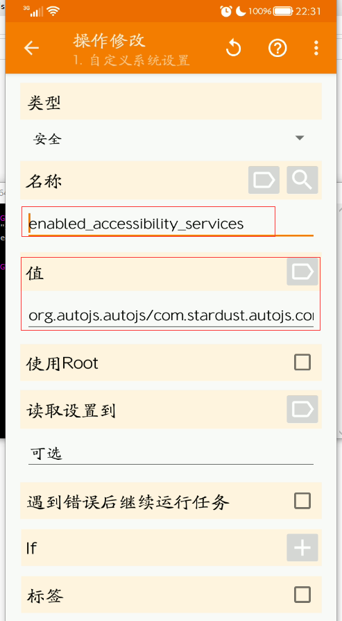
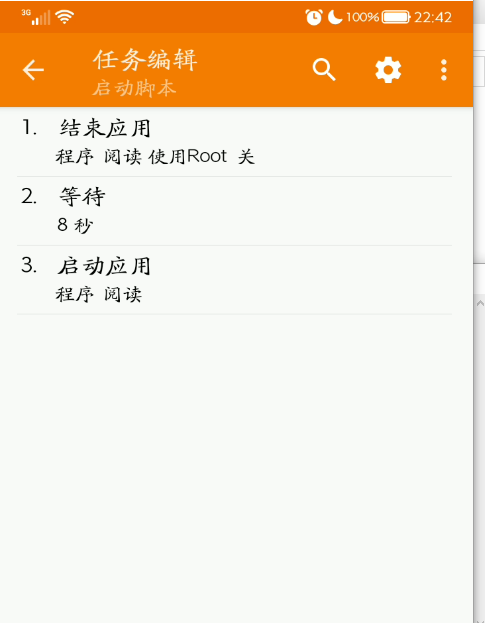
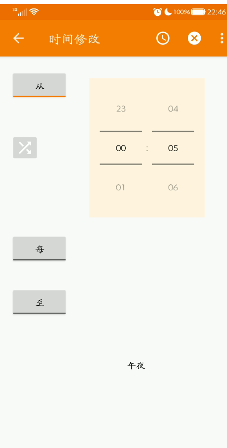
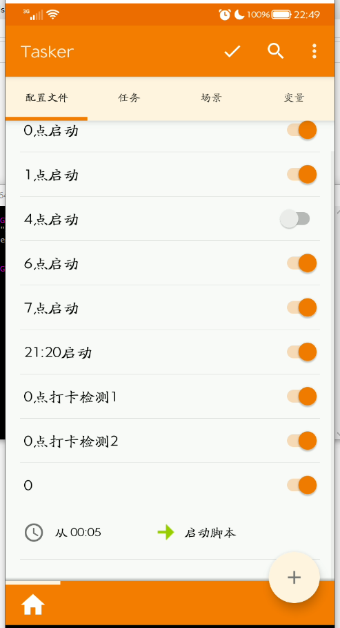

# # 须知

1. 海信A5自动打卡、微信通知需要依托于“阅读小子”App，具体请看：[海信A5自动阅读打卡签到工具软件脚本APK](https://blog.gobyte.cn/post/cbc43a97.html)
2. 电脑一台用于开启无障碍权限。阅读小子依托于“无障碍模式”实现，但是由于Android的一些特性，导致“无障碍模式”会在关机后失效，所以开机又需要手动打开，非常繁琐。所以如果想要实现自动开机打卡，需要解决“无障碍模式”一直是处于打开的状态
3. 自动关机依托于海信A5的定时关机功能，自动开机是借助手机闹钟的功能

# 解决方案

## 开机自动打开无障碍模式

1. 安装Tasker，安装包在群文件中

2. 进入无障碍，将“阅读小子”、“tasker"的无障碍功能打开

3. 进入：设置-关于手机-重复点击”内核版本“，直至显示“您已处于开发者模式……”

4. 进入：设置-其它设置-开发者选项-USB调试，勾选

5. 电脑下载ADB文件，通过CMD执行ADB命令：`adb shell pm grant net.dinglisch.android.taskerm android.permission.WRITE_SECURE_SETTINGS`

6. 打开Tasker-配置文件-点击+号-输入一个名字“自动打开无障碍模式”-事件-输入“设备启动”-返回-新建任务-直接点击√确认-筛选器输入“自定义系统设置”

7. 类型选择：安全。在名称的右侧单击放大镜-选择设置-筛选器里输入`enabled_accessibility_services`。不出意外，最终只有一个选项，而且一大串英文，大胆的点击它

8. 正确的设置如下图

   

9. 点击右上角返回，再返回一次，最终退到了Tasker的“配置文件”的界面，点击“放大镜”左侧的√保存

此时，开机自动打开无障碍模式已经成功，如果你还是不会操作，请跟着这位男主播一起操作，不过他使用的是英文版：[Tasker配置讲解：开机自动打开无障碍开关](https://www.bilibili.com/video/av35027782)

## 设置启动阅读小子

1. 打开tasker-任务，右下角加号，新建任务：《启动脚本》，然后点击√确认

2. 进入“启动脚本”后，右下角加号-筛选器“结束应用”-选择“阅读小子”-左上角返回

3. 继续添加，筛选器“等待”-拖动秒的进度条，我选择8秒-左上角返回

4. 继续添加，右下角加号-筛选器“启动应用”-选择“阅读小子”-左上角返回

5. 最终设置效果如下图

   

## 添加自动启动任务

1. tasker-配置文件-右下角添加-0点打卡-时间，将“至”单击，直至右侧没有时间

2. 在“从”的右侧，拖动你需要启动“阅读小子”的时间，例如我设置的是：0点5分，如下图

   

3. 单击右上角的箭头，返回

4. 此时会弹框，让你选择一个任务，此时我们应该选择上一个环节新建的《启动脚本》任务

5. 单击右上角的√保存设置，最终Tasker的配置文件设置如下图

   

# 须知

1. 阅读小子、Tasker在QQ群文件：获取，早期进群免费，目前进群收费9.9元/台手机
2. 如果认为文字版教程晦涩难懂，请跟着这位男主播一起操作，不过他使用的是英文版：[Tasker配置讲解：开机自动打开无障碍开关](https://www.bilibili.com/video/av35027782)
3. 如果你还有其他的问题，欢迎留言，当然如果能付费进群，自然更好了

