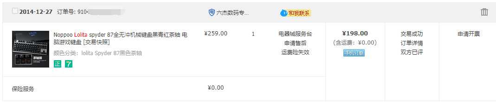
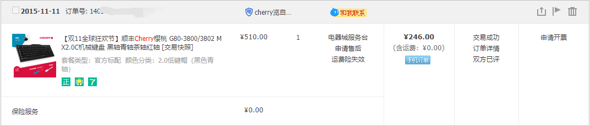
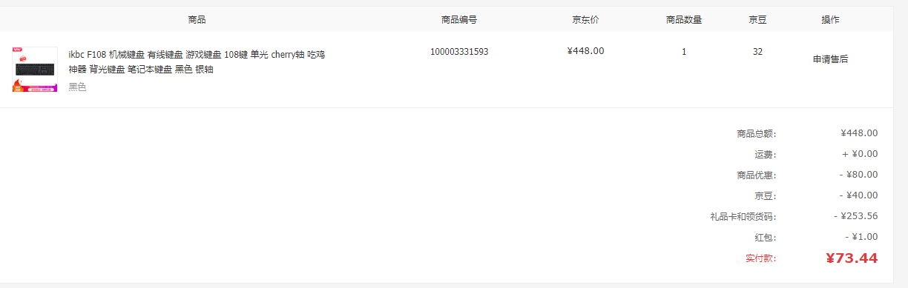
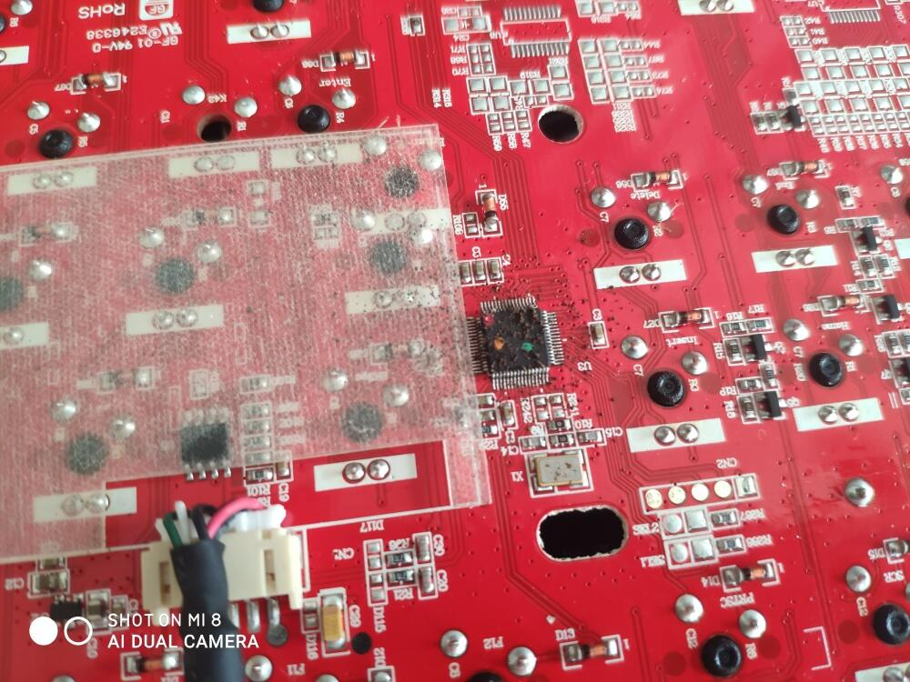
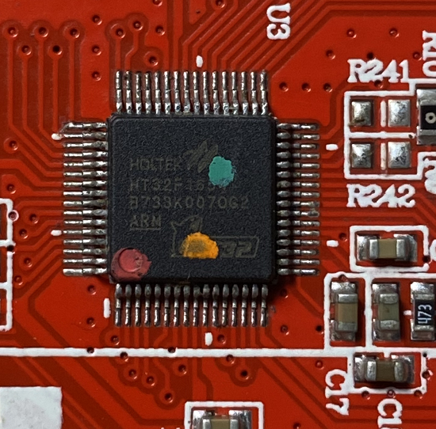
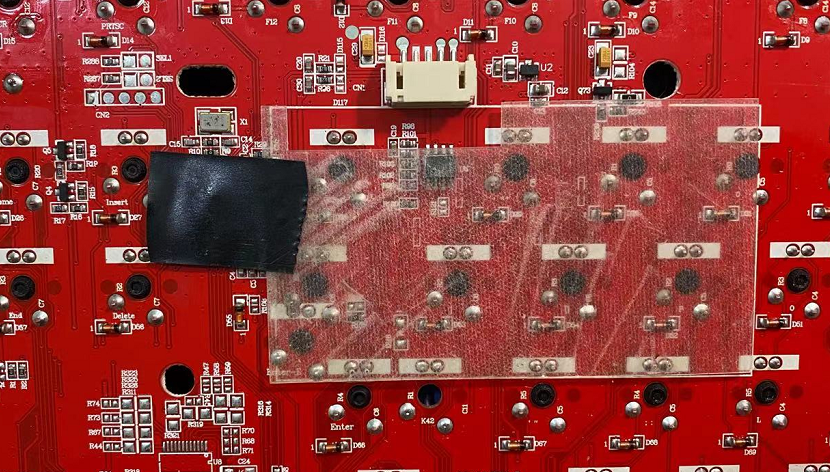
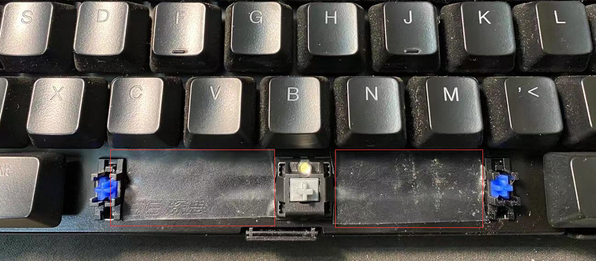

2021年4月12日

作为一个新时代的码农，怎么能没有一块趁手的键盘，那可是干饭的家伙。结合之前自己的经验，最后打算购买一块机械键盘，最好还是cherry轴体的。

# 挑选
在购买IKBC之前，做了不少的功课。例如在站里咨询，查口碑，发现IKBC简直就是国产键盘之光。用料厚道（cherry），性价比高，不买简直是对不起自己！

# 购买
购买时间在2019-06-18，购买的商家是：ikbc京东自营旗舰店，产品型号是F108，商品总额：448元。

# 使用
2019-06-18开始使用，一直到2020年5月就珍藏了。原因是这个键帽比较高，另一个是工作发生变动，没带走继续使用。知道上清明节才拿出来使用，2021年4月12日下午使用过程中发现电脑会自动打字，第一反应不会有大佬黑我电脑吧？我又是拔网线，又是杀毒又是重启的，最后发现是居然是键盘坏了。  

这块IKBC我猜测和轴体关系不大，主要还是键盘的电路板导致的，因为没进水，没磕碰的，不可能是轴体损坏。但是放在家里也是个工业垃圾，只能拿去售后检测维修了。  

故障视频如下（可能需要科学上网）：

备用视频链接：[https://streamja.com/0Pp7k](https://streamja.com/0Pp7k)

<div style="width:100%;height:0px;position:relative;padding-bottom:56.327%;">
    <iframe src="https://streamja.com/embed/0Pp7k" frameborder="0" width="100%" height="100%" allowfullscreen style="width:100%;height:100%;position:absolute;">
    </iframe>
</div>

<video id="video" controls="true" preload="auto" height="50%" width="50%" > <source id="mp4" src="https://files.catbox.moe/yrdkve.MP4" type="video/mp4"> </video>
# 售后
立马掏出手机联系京东自营的IKBC客服，我又是拍视频，又是拍照片，客服问了型号以后告诉FN+R可以重置恢复出厂。我尝试无效，给了我一个联系方式，让我找技术支持。联系方式如下：
```
咱们的售后技术电话是：4000174417、（与Q同步）
2661282134技术上班时间（周一到周五早上9点到下午6点）您有任何问题都可以来电咨询，让咱们的技术给您看看是什么问题，技术那边可以和您视频查看您的键盘的情况呢
```
QQ:2661282134加上了，目前她也没办法判断故障，给出解决方法是邮寄过去检测，地址如下：
```
售后服务中心：北京汉德默兹克科技有限公司昌平分公司 
北京市昌平区百沙路新飞达电子科技工业发展中心1号楼F5-3 13051760861 李鹏 
 工作时间：9：00-18：00
【返件请一定备注联系方式和注明详细故障 】 拒收邮政和到付
```
# 看法

我内心是不看好此次售后的，因为我第一款机械键盘是买的Lolita这个国产牌子。用了不到几个月就开始按键无反应，连按等故障。 那时候还年轻，售后了2次，邮费也花了几十块。

1. 第一块键盘虽然多次售后，但是键盘故障就像打地鼠一样，这里好了，那里又蹦出来了，没办法只能放弃了。买洛丽塔是因为微博的一个大V推荐，喜欢玩手机的同学应该认识，这个人是[@潘九堂](https://weibo.com/p/1005051569990961)。后来才知道这才是**最早的KOL带货**，当时是2014年。下面是购买的订单截图：
   

2. 第二块键盘是在2015-11-11购买的，记的很清楚的，当晚22点左右马云发了个大红包，原因是阿里巴巴敲钟上市，最后是345-99=246入手。这键盘进水多次，最后一次是进水吹风机把键帽吹变形，疫情期间换了键帽还顶了一阵子。
   

3. 第三块机械键盘是IKBC的F108，至于质量我就是很好的例子。448元cherry银轴，目前故障是多个按键乱按。
   

-------

总体而言，3块键盘，2块国产，国产使用寿命最短，体验也最差。我将会继续更新后续，直至有个结果。


**虽然如此，但是我依然希望国货当自强！**

----

# 2021年4月16日-更新

售后客服手机号：18514203108联系我，是键盘进了小强，导致电路板腐蚀，更换整个主板是200元。我联系QQ客服2661282134 发一下照片，如下：




**自认倒霉，不修了，闲鱼现在也只要190元。感谢阅读。**

# 2021年4月18日更新，键盘已经修复

修复方法很简单：清洁电路板。原来主控芯片上面都是小强粑粑，售后也没有帮我清理，直接原封寄回来了。

我自己拿毛刷子把主控芯片刷干净即可，最后给主控贴上电工胶带，避免下次再有小强捣乱。

另外空格键下面也有空洞，容易钻小强，建议封堵。具体请看图：








----

# 相同案例

1. [正常使用进了蟑螂导致机械键盘损坏应该保修吗？？ NGA玩家社区 P1](https://bbs.nga.cn/read.php?tid=17610765&rand=937)
2. [我的ikbc g108 进蟑螂后主控被腐蚀，现在返给卖家说是修要140...](https://tieba.baidu.com/p/6097615556?red_tag=3268680140)